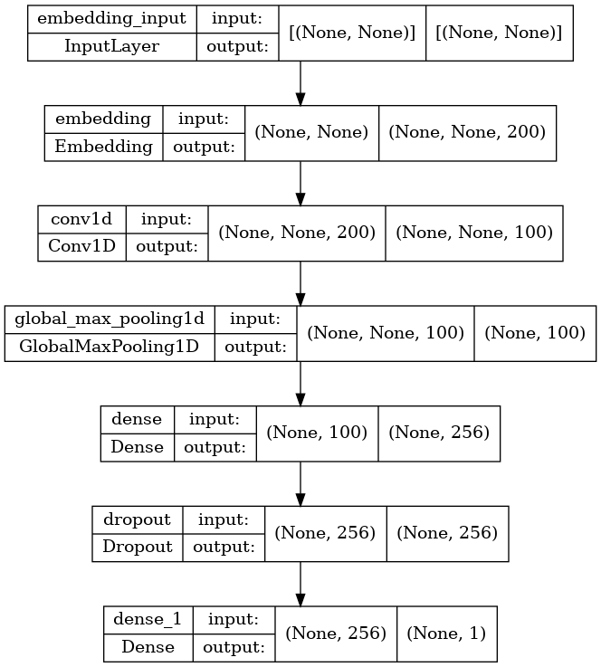
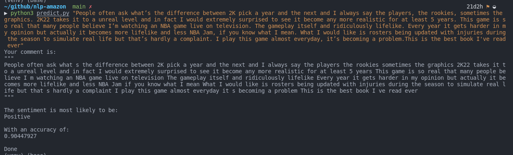

# Neural Network Sentiment Analysis

This project was presented as an University assignment in the Big Data and Analytic Intelligence Degree at Centro Universitário Leonardo Da Vinci - Brazil

- It is highly recommended that you have a GPU if you want to run train scripts.
- This code can take a while depending on the environment you're running it.

Follow the instructions here:

https://www.tensorflow.org/install/pip

Then 

``` 
conda activate tf
```
If necessary you'll need to run either 
```
pip install <dependency>
```
or 
```
conda install <dependency>
```

## Dataset: 
[Amazon Reviews for Sentiment Analysis](https://www.kaggle.com/datasets/bittlingmayer/amazonreviews)

_obs: Just joined both train and test datasets, and splited again in the code after some data processing in the single txt file._

### Model layers:

## Predict:

run 

```
python3 predict.py "Comment you want to predict goes here as a python string"
```

or just

```
python3 predict.py
```
and it will prompt a message so you can input the comment

## Use example:
